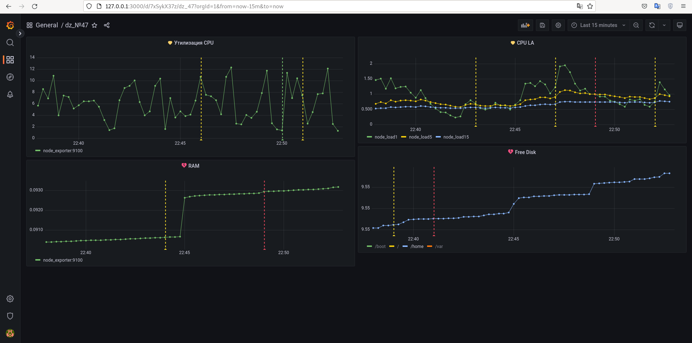

## Задание 2
- Утилизация CPU для nodeexporter (в процентах, 100-idle)
  - 100*(1-avg by(instance) (irate(node_cpu_seconds_total{instance=\"node_exporter:9100\", mode=\"idle\"}[5m])))
- CPULA 1/5/15
  - node_load1{instance="node_exporter:9100", job="node_exporter"}
  - node_load5{instance="node_exporter:9100", job="node_exporter"}
  _node_load15{instance="node_exporter:9100", job="node_exporter"}
- Количество свободной оперативной памяти
  - node_memory_Active_bytes/on (instance) node_memory_MemTotal_bytes
- Количество места на файловой системе
  - 100-(100 *((node_filesystem_avail_bytes)/(node_filesystem_size_bytes{ mountpoint="/boot",fstype!="tmpfs"})))
  - 100-(100 *((node_filesystem_avail_bytes)/(node_filesystem_size_bytes{ mountpoint="/var",fstype!="tmpfs"})))
  - 100-(100 *((node_filesystem_avail_bytes)/(node_filesystem_size_bytes{ mountpoint="/home",fstype!="tmpfs"})))
  - 100-(100 *((node_filesystem_avail_bytes)/(node_filesystem_size_bytes{ mountpoint="/",fstype!="tmpfs"})))
#### Dashboard




## Задание 3

#### Итоговый dashboard


> [!NOTE]
> ghbdgf

#### Notification


## Задание 4

```
{
  "annotations": {
    "list": [
      {
        "builtIn": 1,
        "datasource": {
          "type": "grafana",
          "uid": "-- Grafana --"
        },
        "enable": true,
        "hide": true,
        "iconColor": "rgba(0, 211, 255, 1)",
        "name": "Annotations & Alerts",
        "target": {
          "limit": 100,
          "matchAny": false,
          "tags": [],
          "type": "dashboard"
        },
        "type": "dashboard"
      }
    ]
  },
  "editable": true,
  "fiscalYearStartMonth": 0,
  "graphTooltip": 0,
  "id": 1,
  "links": [],
  "liveNow": false,
  "panels": [
    {
      "datasource": {
        "type": "prometheus",
        "uid": "rx6JTUqnz"
      },
      "fieldConfig": {
        "defaults": {
          "color": {
            "mode": "palette-classic"
          },
          "custom": {
            "axisLabel": "",
            "axisPlacement": "auto",
            "barAlignment": 0,
            "drawStyle": "line",
            "fillOpacity": 0,
            "gradientMode": "none",
            "hideFrom": {
              "legend": false,
              "tooltip": false,
              "viz": false
            },
            "lineInterpolation": "linear",
            "lineWidth": 1,
            "pointSize": 5,
            "scaleDistribution": {
              "type": "linear"
            },
            "showPoints": "auto",
            "spanNulls": false,
            "stacking": {
              "group": "A",
              "mode": "none"
            },
            "thresholdsStyle": {
              "mode": "off"
            }
          },
          "mappings": [],
          "thresholds": {
            "mode": "absolute",
            "steps": [
              {
                "color": "green",
                "value": null
              },
              {
                "color": "red",
                "value": 80
              }
            ]
          }
        },
        "overrides": []
      },
      "gridPos": {
        "h": 9,
        "w": 12,
        "x": 0,
        "y": 0
      },
      "id": 2,
      "options": {
        "legend": {
          "calcs": [],
          "displayMode": "list",
          "placement": "bottom"
        },
        "tooltip": {
          "mode": "single",
          "sort": "none"
        }
      },
      "targets": [
        {
          "datasource": {
            "type": "prometheus",
            "uid": "rx6JTUqnz"
          },
          "editorMode": "code",
          "expr": "100*(1-avg by(instance) irate(node_cpu_seconds_total{instance=\"node_exporter:9100\", mode=\"idle\"}[5m])))",
          "legendFormat": "__auto",
          "range": true,
          "refId": "A"
        }
      ],
      "title": "Утилизация CPU",
      "type": "timeseries"
    },
    {
      "datasource": {
        "type": "prometheus",
        "uid": "rx6JTUqnz"
      },
      "fieldConfig": {
        "defaults": {
          "color": {
            "mode": "palette-classic"
          },
          "custom": {
            "axisLabel": "",
            "axisPlacement": "auto",
            "barAlignment": 0,
            "drawStyle": "line",
            "fillOpacity": 0,
            "gradientMode": "none",
            "hideFrom": {
              "legend": false,
              "tooltip": false,
              "viz": false
            },
            "lineInterpolation": "linear",
            "lineWidth": 1,
            "pointSize": 5,
            "scaleDistribution": {
              "type": "linear"
            },
            "showPoints": "auto",
            "spanNulls": false,
            "stacking": {
              "group": "A",
              "mode": "none"
            },
            "thresholdsStyle": {
              "mode": "off"
            }
          },
          "mappings": [],
          "thresholds": {
            "mode": "absolute",
            "steps": [
              {
                "color": "green",
                "value": null
              },
              {
                "color": "red",
                "value": 80
              }
            ]
          }
        },
        "overrides": []
      },
      "gridPos": {
        "h": 8,
        "w": 12,
        "x": 12,
        "y": 0
      },
      "id": 4,
      "options": {
        "legend": {
          "calcs": [],
          "displayMode": "list",
          "placement": "bottom"
        },
        "tooltip": {
          "mode": "single",
          "sort": "none"
        }
      },
      "targets": [
        {
          "datasource": {
            "type": "prometheus",
            "uid": "rx6JTUqnz"
          },
          "editorMode": "builder",
          "expr": "node_load1",
          "interval": "",
          "legendFormat": "{{__name__}}",
          "range": true,
          "refId": "A"
        },
        {
          "datasource": {
            "type": "prometheus",
            "uid": "rx6JTUqnz"
          },
          "editorMode": "builder",
          "expr": "node_load5",
          "hide": false,
          "legendFormat": "{{__name__}}",
          "range": true,
          "refId": "B"
        },
        {
          "datasource": {
            "type": "prometheus",
            "uid": "rx6JTUqnz"
          },
          "editorMode": "builder",
          "exemplar": false,
          "expr": "node_load15",
          "hide": false,
          "legendFormat": "{{__name__}}",
          "range": true,
          "refId": "C"
        }
      ],
      "title": "CPU LA",
      "type": "timeseries"
    },
    {
      "datasource": {
        "type": "prometheus",
        "uid": "rx6JTUqnz"
      },
      "fieldConfig": {
        "defaults": {
          "color": {
            "mode": "palette-classic"
          },
          "custom": {
            "axisLabel": "",
            "axisPlacement": "auto",
            "barAlignment": 0,
            "drawStyle": "line",
            "fillOpacity": 0,
            "gradientMode": "none",
            "hideFrom": {
              "legend": false,
              "tooltip": false,
              "viz": false
            },
            "lineInterpolation": "linear",
            "lineWidth": 1,
            "pointSize": 5,
           "scaleDistribution": {
              "type": "linear"
            },
            "showPoints": "auto",
            "spanNulls": false,
            "stacking": {
              "group": "A",
              "mode": "none"
            },
            "thresholdsStyle": {
              "mode": "off"
            }
          },
          "mappings": [],
          "thresholds": {
            "mode": "absolute",
            "steps": [
              {
                "color": "green",
                "value": null
              },
              {
                "color": "red",
                "value": 80
              }
            ]
          }
        },
        "overrides": [
          {
            "__systemRef": "hideSeriesFrom",
            "matcher": {
              "id": "byNames",
              "options": {
                "mode": "exclude",
                "names": [
                  "/home"
                ],
                "prefix": "All except:",
                "readOnly": true
              }
            },
            "properties": [
              {
                "id": "custom.hideFrom",
                "value": {
                  "legend": false,
                  "tooltip": false,
                  "viz": true
                }
              }
            ]
          }
        ]
      },
      "gridPos": {
        "h": 8,
        "w": 12,
        "x": 12,
        "y": 8
      },
      "id": 8,
      "options": {
        "legend": {
          "calcs": [],
          "displayMode": "list",
          "placement": "bottom"
        },
        "tooltip": {
          "mode": "single",
          "sort": "none"
        }
      },
      "targets": [
        {
          "datasource": {
            "type": "prometheus",
            "uid": "rx6JTUqnz"
          },
          "editorMode": "code",
          "expr": "100-(100 *((node_filesystem_avail_bytes)/node_filesystem_size_bytes{ mountpoint=\"/boot\",fstype!=\"tmpfs\"})))",
          "legendFormat": "{{mountpoint}}",
          "range": true,
          "refId": "A"
        },
        {
          "datasource": {
            "type": "prometheus",
            "uid": "rx6JTUqnz"
          },
          "editorMode": "code",
          "expr": "100-(100 *((node_filesystem_avail_bytes)/node_filesystem_size_bytes{ mountpoint=\"/\",fstype!=\"tmpfs\"})))",
          "hide": false,
          "legendFormat": "{{mountpoint}}",
          "range": true,
          "refId": "B"
        },
        {
          "datasource": {
            "type": "prometheus",
            "uid": "rx6JTUqnz"
          },
          "editorMode": "code",
          "expr": "100-(100 *((node_filesystem_avail_bytes)/node_filesystem_size_bytes{ mountpoint=\"/home\",fstype!=\"tmpfs\"})))",
          "hide": false,
          "legendFormat": "{{mountpoint}}",
          "range": true,
          "refId": "C"
        },
        {
          "datasource": {
            "type": "prometheus",
            "uid": "rx6JTUqnz"
          },
          "editorMode": "code",
          "expr": "100-(100 *((node_filesystem_avail_bytes)/node_filesystem_size_bytes{ mountpoint=\"/var\",fstype!=\"tmpfs\"})))",
          "hide": false,
          "legendFormat": "{{mountpoint}}",
          "range": true,
          "refId": "D"
        }
      ],
      "title": "Free Disk",
      "type": "timeseries"
    },
    {
      "datasource": {
        "type": "prometheus",
        "uid": "rx6JTUqnz"
      },
      "fieldConfig": {
        "defaults": {
          "color": {
            "mode": "palette-classic"
          },
          "custom": {
            "axisLabel": "",
            "axisPlacement": "auto",
            "barAlignment": 0,
            "drawStyle": "line",
            "fillOpacity": 0,
            "gradientMode": "none",
            "hideFrom": {
              "legend": false,
              "tooltip": false,
              "viz": false
            },
            "lineInterpolation": "linear",
            "lineWidth": 1,
            "pointSize": 5,
            "scaleDistribution": {
              "type": "linear"
            },
            "showPoints": "auto",
            "spanNulls": false,
            "stacking": {
              "group": "A",
              "mode": "none"
            },
            "thresholdsStyle": {
              "mode": "off"
            }
          },
          "mappings": [],
          "thresholds": {
            "mode": "absolute",
            "steps": [
              {
                "color": "green",
                "value": null
              },
              {
                "color": "red",
                "value": 80
              }
            ]
          }
        },
        "overrides": []
    },
      "gridPos": {
        "h": 8,
        "w": 12,
        "x": 0,
        "y": 9
      },
      "id": 6,
      "options": {
        "legend": {
          "calcs": [],
          "displayMode": "list",
          "placement": "bottom"
        },
        "tooltip": {
          "mode": "single",
          "sort": "none"
        }
      },
      "targets": [
        {
          "datasource": {
            "type": "prometheus",
            "uid": "rx6JTUqnz"
          },
          "editorMode": "builder",
          "expr": "node_memory_Active_bytes/on (instance) node_memory_MemTotal_bytes",
          "legendFormat": "__auto",
          "range": true,
          "refId": "A"
        }
      ],
      "title": "RAM",
      "type": "timeseries"
    }
  ],
  "refresh": "",
  "refresh": false,
  "schemaVersion": 36,
  "style": "dark",
  "tags": [],
```
